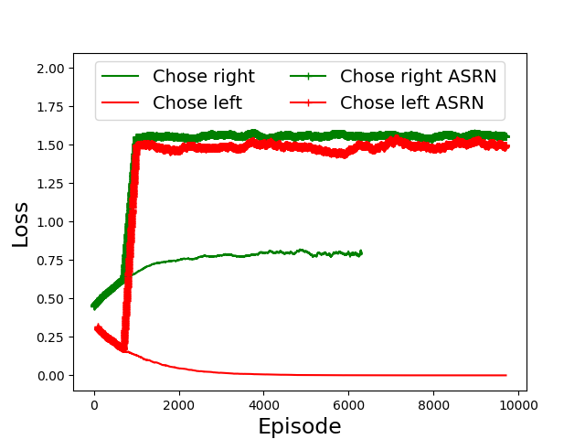
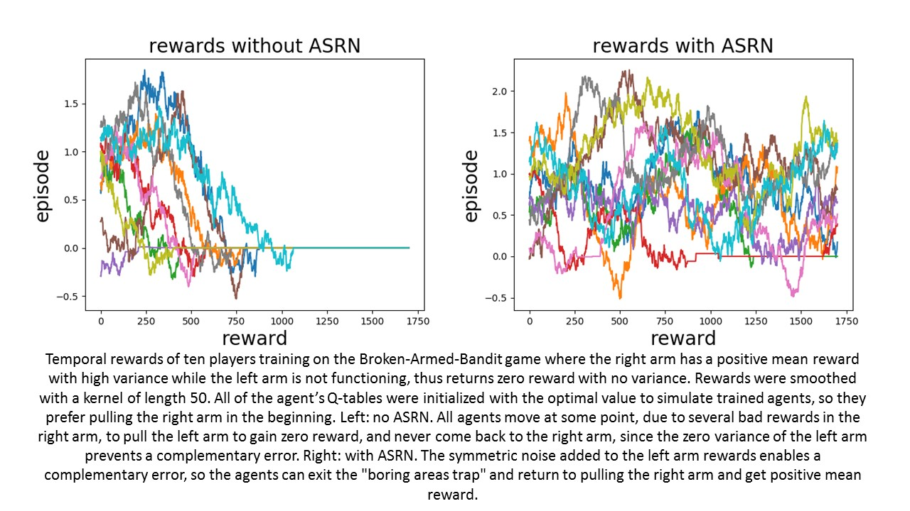
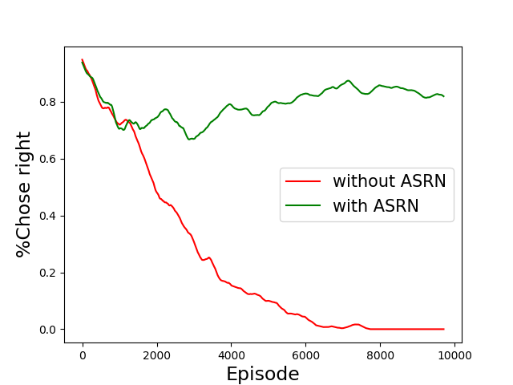
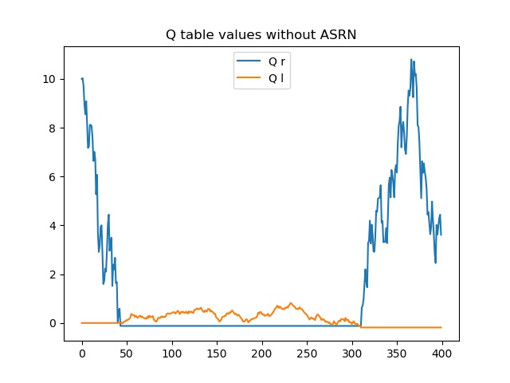
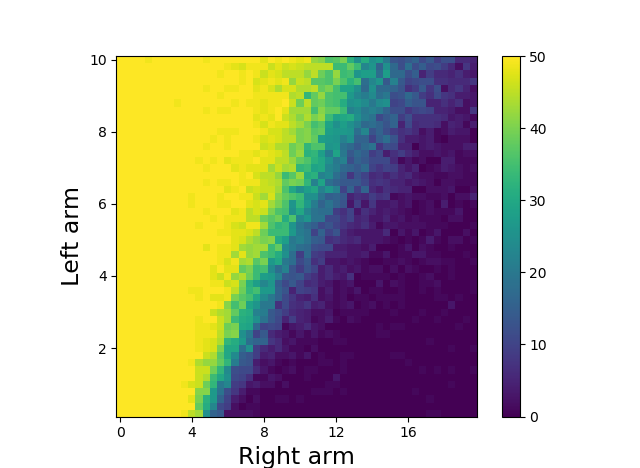
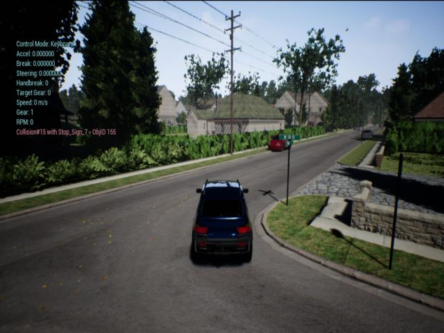
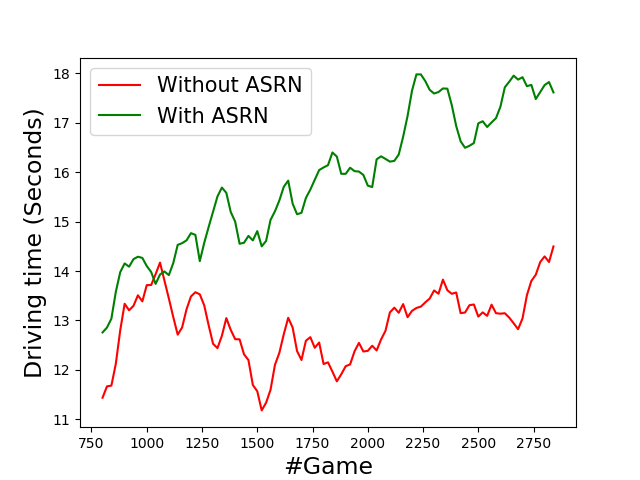

# Two-Armed-Bandit

Imagine you go to the bank and ask for an investment consultant.  
They give you one, and you first ask how he charges.  
Is it according to the profit he'll make you?  
"No" he says "The more accurate I am in my return predictions, you'll pay me more.  but I will be tested only on the investments you chose to take."  
This smells a bit fishy, and you start sniffing around for other people who are using this consultant.  
Turn out he recommended them all only government bonds with low return and low variability. 
He even told them this has the highest mean return!  
They all believed him, bought the bonds, and of course he was pretty accurate about the return, with very little error. So they had to pay him his maximum fee.   
What do you think about this guy? I think he is a kind of a "Manipulative Consultant".  
   
**And I think everyone in Reinforcement Learning are using just this guy.**   

Currently, in Reinforcement Learning there are two leading families of algorithms: DQN and Actor Critic. Both are using a consultant function - a deep neural network which estimates the value of a state. In DQN it's the Q-network, and in AC it's the Critic network. Everybody pays this consultant according to his accuracy: the loss function which is used to optimize the network is based on it's prediction error. And it is tested on the actions he chose: The policy will do what the network advised as best, and this will be the only future experience.  

Now, everybody complains that [RL doesn't work yet](https://www.alexirpan.com/2018/02/14/rl-hard.html) and that [Deep is hardly helping](https://himanshusahni.github.io/2018/02/23/reinforcement-learning-never-worked.html).
And with just. Training a RL algorithm is brittle: It's highly depends on the initialization of the network and the parameters, so you repeat the same experiment again and again. You see your algorithm improving and then retreats. You're puzzled because it does so while the loss function continues improving. You can choose the best temporary network along the way and call it a day, but there is nothing you can do to further improve the result.  

So what we claim here is that you just chose the wrong consultant. Or at least chose the wrong way to pay him. It's choosing low-reward actions, and tells you they are high-reward ones, so he'll be more accurate because they are so low-variance and predictable. And you'll never catch its manipulation cause you keep testing it on what it chose.  

First, let's prove this loss-gaps exists. We take a simple game: two slots machines (or "Multi-Armed Bandit" as they're called in RL), the right one gives 1 reward but with high variance, and the left one is broken, so it gives 0 reward with 0 variance. We call it the Broken-Armed-Bandit.  
Now, you have to decide which one to use each game episode. Seems easy? Not for Q-learning. 

Take a look on the two thin lines below. They show the loss of the ones that are currently choosing the right handle (thin line, green) vs those chose left (thin line, red). It is clear that those that chose left are doing much better and will have lower loss.  
Now, every good RL algorithm has its exploration scheme. So here we used the epsilon-greedy scheme, with a decaying epsilon. And indeed, with 100% exploration it tests the consultant on things it didn't ask for, and it's getting about the same loss. But this is true only at the beginning of the training. As the epsilon decays, the exploration decreases, and the red thin line keeps reducing. Now if you saw that line in a real training, wouldn't you think everything is great since the loss is declining? Actually what you're watching is a lazy network being reed of the hard tests of the exploration.  
 <br/>
 
 
 **The mean loss during training. Chose Right: mean loss of right-choosing agents without ASRN. Chose left: mean loss of left choosing agents, without ASRN. Chose right ASRN:mean loss of right-choosing agents with ASRN. Chose left ASRN: mean loss of left choosing agents with ASRN. Without ASRN the loss differences are increasing with the exploration decay, which causes the "Manipulative Consultant" problem, while with ASRN the loss is high but comparable in both groups.**
 <br/>

What we saw is a gap in the loss, where the boring decisions are winning. When we optimize a deep-network by minimizing this loss, sometimes it will favor the boring decisions to minimize its loss. But what if we don't use DNN at all? What if we use good old Q-learning, with a Q table?  
There is still one problem and it is called the "Boring Areas Trap".

Imagine you have a car with free gas, and someone is giving you a free pizza 1 mile away from your home. So if you don't drive there you get a mean of 0 pizza with 0 variance. If you do drive there you get a mean of 1 pizza, but with high variance: with a very small probability, you may have a car accident and you'll spend six months in cast, in agonizing pains, loosing thousands on your ruined car.  
Normally, this is a simple decision: you never had a car accident before, you estimate the chances it will happen as low, and you prefer the higher pizza mean. So you go there and get the pizza.  
But what if you're unlucky, and after only 100 drives you had a car accident? Now you estimate the chances that it would happen to be much higher than the true probability. The estimated mean reward from driving to the free pizza becomes negative and you decide to stay home.  
Now here is the catch: you will never drive again, and hence will never change your mind about driving. You will keep believing it has negative mean reward, you're experience from staying home will validate your beliefs about the mean return of staying home, and nothing will change.  
How can you get out of home anyway? Well, there has to happens a **complementary error**. For example, you stay at home and a shelf falls on your head. Once again, agonizing pains. Now, you have no one to blame but your shelf. Your estimation of staying at home is becoming negative too. And if it is lower than your estimation of leaving home, only then you will go out again for that pizza. 
Note that there was no optimization involved: You had a Q-table of one state: a hungry state, and two actions: go or no go to the pizza. You calculated the means directly from the rewards you got. This was the best thing you could do, however you ended up stuck at home until this shelf got you out. 

This phenomenon can be simulated with the same Broken-Armed-Bandit from above. But now we can try and solve it using Q-learning. 
Let's look at 10 agents training on this task (left):  


  
We can see that all of them, at some point, go to gain zero reward, meaning they choose to pull the malfunctioning arm. Think about them, standing in a line, pulling the dead machine arm, ignoring the working machine with all the lights to its right. Don't they look stupid? Well, the joke is on us for using them as our experts. Note: to speed up things, we chose a high learning rate of 0.1, so things that usually happens after millions of iterations will happen very quickly.  
 
Now, lets take a hundred of them and look how many chose the left, nonworking arm. They are on the red line:
 
 
 
**Probability of an agent to choose pulling the right arm, during a training on the Broken-Armed-Bandit game. without ASRN: Agent training with plain Q-learning algorithm. All agents move eventually to pull the left arm with zero reward, and never come back to the right arm. WithASRN: Agent training with Q-learning algorithm with the ASRN scheme for reward noising. The symmetric noise enables a complementary error, so agents can exit the "boring areas trap".**

Once again, it took some time but all of them chose the left arm as their best option.  

To see what's going on, we will look at one agent inner parameters, the values of Q_left and Q_right in it's Q-table. We removed all exploration to see what's really happening, and initialized the parameters to be optimal, so **this is a well-trained agent**, at least at the start. The right arm has high variance as before. Here we gave a small variance to the left arm as well, so this is a regular two-armed-bandit problem with variance differences:
 
 
 **The parameters from the Q table of one training agent along the training process. The agent enters the boring areas trap at episode 40, and exits at episode 320, when the complementary error occurs. Low variance in the left arm will delay this complementary error.**
 
The right arm has high variance. So its estimation Q_right has also high variance, though much lower since it is summed with past rewards. Q_right, because of a few concentrated bad rewards, becomes lower than Q_left at episode 40.  
From that point the agent chooses only the left handle. So it entered the "Boring Areas Trap". Now, Q_right can't change due to lack of examples. Q_left is hardly changing due to low variance. And this is why we call it a trap, ladies and gentleman!
At episode 320, the complementary error occurs. Q_left becomes lower than the falsely-low Q_right. This is when we get out of the trap and start pulling the right arm, getting better estimations of Q_right.  

What variance differences cause this problem? Here we can see a map, for different values of σ_l and σ_r:
 <br/>
 
   
 **The influence of σ_l, σ_r on the success frequency. Right arm: different σ_r for the right arm. Left arm: different σ_l for the right arm. Severe variance differences cause the "boring areas trap". Minor differences enable the "Manipulative Consultant" problem** 
  
At the bottom-left are there is a big region where all agents fail, due to large variance differences. There is another area at the center where agents are jumping on and off the trap, due to lower variance differences. Only when the variance differences are low Q-learning is working. A lower learning rate will move the dark areas further to the right, but will lower the, well, learning rate, so training will be very slow. 
 
The proposed solution comes from a [weird experiment in human cognition.](https://www.ncbi.nlm.nih.gov/pmc/articles/PMC2678746/) They did an experiment called "Agriculture on march" which is the same as the two-armed-bandit, but when each action moves both machines means. Weird indeed. They found that adding little noise to the reward paradoxically helps people *"rule out simple hypotheses and encourage sampling of alternatives"* and actually help them gain more rewards!  
We can do that here too. We can add a symmetric noise to the reward, so it will not influence the mean reward.  
But if we add noise to all rewards equally, there will still be a loss gap in favor of the left machine. So we want it to be adaptive, meaning we'll add noise only to the low-variance actions. 
If we do this we get the thick lines in the graph.  
 
     
This means we added a lot of noise to the rewards, but now there is about the same amount of noise in both machines.  
So this is what ASRN, or Adaptive Symmetric Reward Noising, does: it estimates which states/actions have low variance, and add noise only to them. How does it estimates? Using the update to the Q_table. The bigger this update is, the more surprising this reward is, and the less noise it will get. 
You can see bins_ASRN.py to see how it's implemented.
When we check it on the Broken-Armed-Bandit above, we see it helps them get out of the boring-areas-trap, when now we're looking at the green line:  
 
   
 Now, this is nice on bandits, but what about some real stuff? Well, driving is a very suitable example. Just as with the pizza above, there is a strategy which will give you low reward with low variance - like "go left till you crash". On the other hand, there is the strategy of actually driving, which will sometimes give you high reward when you'll reach the target, but with high variance - there are many dangers waiting along the road. We trained using AirSim Neighborhood driving simulation. It is great realistic simulation:
   
[   ](https://youtu.be/aoft3T_77sQ)
 
 **The AirSim realistic driving simulator, with the suburban "Neighborhood" environment. A drive of the our best trained model can be found at https://youtu.be/aoft3T_77sQ**  
   
 and they already implemented a DQN agent. So all is left to do is to plug in the ASRN and look at the mean driving time (green) compared to without ASRN:   
 
 
 **Training DQN agent for autonomous driving in the AirSim simulator. Driving time - best in last 20 trials, smoothed by a kernel of length 40. Without ASRN: DQN algorithm from [11]. WithASRN: DQN algorithm from [11], with reward noising using the ASRN scheme.
 <br/>**
 
 Now, obviously reward noising is not an complete solution. A lot of sophisticated exploration needs to be done in parallel, together with other tricks. The Manipulative Consultant and Boring Areas Trap problems are questions which are better than the current answers. But it is important to bare in mind those problems when we come to plan our RL strategy. It's crucial to think: are there variance differences? How are they affecting the chosen algorithm? And maybe this will lead to a more stable RL.
   
 You can see this experiment in the ["DistributedRL" repository](https://github.com/ManipulativeConsultant/AutonomousDrivingCookbook) 
   
### Installation and usage

The following command should train an agent on Two-Armed-Bandit with default experiment parameters.

```
python run.py
```

## Authors
Currently anonymous, since the paper is in peer-review.

## License

This project is licensed under the MIT License - see the [LICENSE.md](LICENSE.md) file for details


