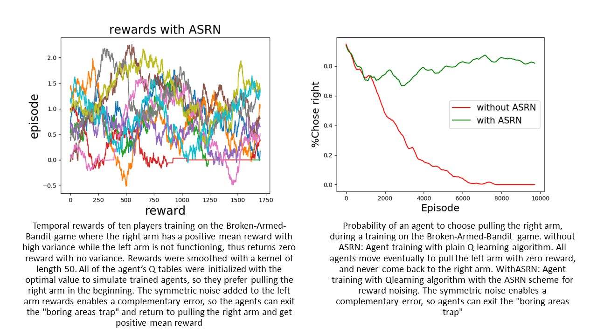
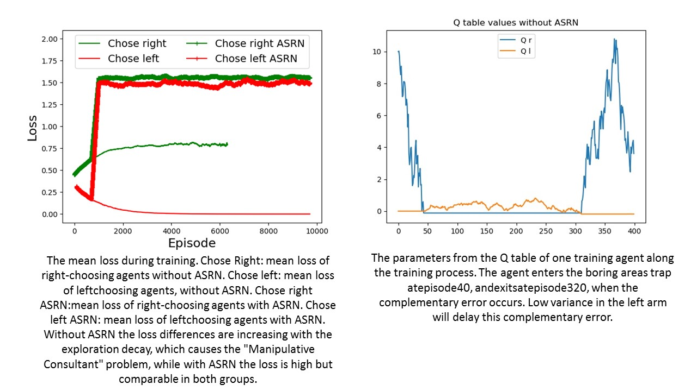
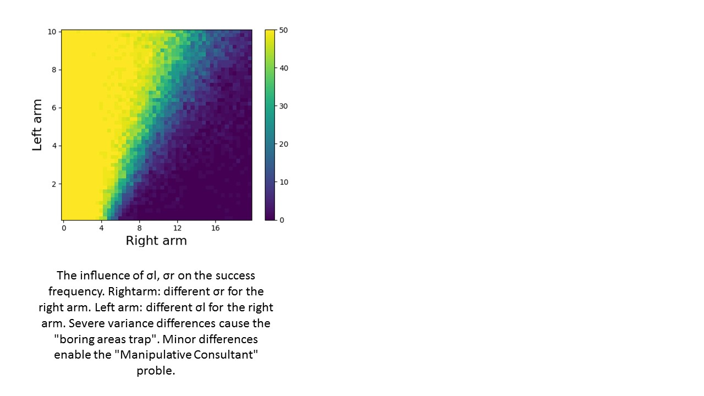

# Two-Armed-Bandit

Our experiment takes place in the well-studied Multi-Armed Bandit (MAB) environment, with
only two arms, with different rewards distributions: 
the right arm has a positive reward mean and a high reward variance, while the left arm has zero reward mean and low variance. 
While this problem
is easily solved with many basic reinforcement learning algorithms, we found that consultant-based
methods like Q-learning show a unique behavior.
<br/>
<br/>
 
 
 
   
### Installation and usage

The following command should train an agent on Two-Armed-Bandit with default experiment parameters.

```
python run.py
```


## Built With

* 
* 
* 

## Contributing


 

## Authors


## License

This project is licensed under the MIT License - see the [LICENSE.md](LICENSE.md) file for details


